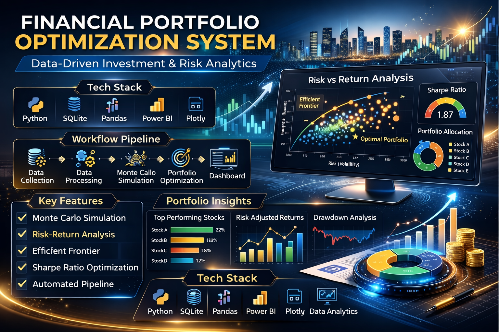
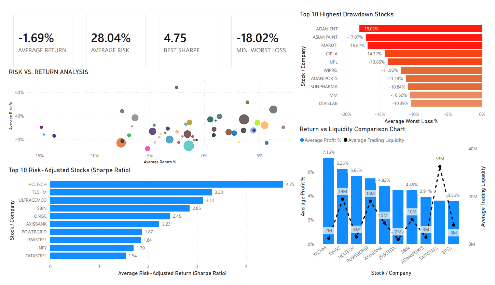

<!-- ===================== BANNER ===================== -->
<p align="center"> 
   
</p>

<!-- ===================== TYPING ANIMATION ===================== -->
<h1 align="center">
  
</h1>

<p align="center">
  🚀 <b>End-to-End Financial Analytics Pipeline for Smart Investment Decisions</b>
</p>

---

<!-- ===================== PREMIUM BADGES ===================== -->

<p align="center">
  
  
  
</p>

<p align="center">
  
  
  
</p>

<p align="center">
  
  
  
</p>

<p align="center">
  <b>💹 Transforming Raw Market Data → Intelligent Investment Strategies</b>
</p>

---

# 📊 GitHub Analytics

<p align="center">
  
  
</p>

<p align="center">
  
</p>

---

# 📊 Project Overview

<p align="center">
  
</p>

This project builds a **data-driven financial analytics system** to analyze **NIFTY 50 stocks** and identify **optimal portfolio strategies** using quantitative finance techniques.

It integrates:
- 📂 Data Engineering  
- 📈 Financial Modeling  
- ⚡ Automation Pipelines  
- 📊 Interactive Visualization  

---

# 🧠 Problem Statement

Investors struggle to balance **risk and return**.

This project solves it by:
- Analyzing stock performance  
- Measuring volatility & risk  
- Simulating thousands of portfolios  
- Identifying optimal allocations  

---

# 🏗️ System Architecture

```mermaid
flowchart LR
    A[📂 CSV Files - Kaggle] --> B[(🗄️ SQLite Database)]
    B --> C[🧹 Data Preprocessing]
    C --> D[📊 Returns Calculation]
    D --> E[🎲 Monte Carlo Simulation]
    E --> F[📈 Efficient Frontier]
    F --> G[🎯 Optimal Portfolio]
    G --> H[⚡ Automation Pipeline]
    H --> I[📊 Power BI Dashboard]
````

---

# 📈 Live Market Snapshot

<p align="center">
  
</p>

<p align="center">
  <a href="https://www.tradingview.com/symbols/NSE-RELIANCE/">
    
  </a>
  <a href="https://www.tradingview.com/symbols/NSE-TCS/">
    
  </a>
</p>

---

# ⚙️ Tech Stack

<p align="center">
  
</p>

<p align="center">
  
  
  
  
  
</p> 

---

# 📊 Key Features

✨ Data preprocessing & cleaning
✨ Correlation analysis (diversification)
✨ Monte Carlo Simulation (5000+ portfolios)
✨ Efficient Frontier construction
✨ Sharpe Ratio optimization
✨ Automated data pipeline
✨ Interactive dashboard

---

# 📸 Dashboard Preview

<p align="center">
  
</p>

---

# 🎲 Monte Carlo Simulation

<p align="center">
  
</p>

* Generated thousands of random portfolios
* Evaluated risk vs return
* Identified optimal portfolios

---

# 📈 Sample Insights

<p align="center">
  
</p>

✔ Best risk-adjusted stocks identified
✔ Optimal portfolio allocation achieved
✔ Improved performance vs equal-weight strategy

---

# ⚡ Automation Pipeline

✔ Loads data from SQLite
✔ Calculates financial metrics
✔ Runs Monte Carlo simulation
✔ Exports results for dashboard

---

# 📂 Project Structure

```
├── assets/
│   ├── banner.png
│   └── dashboard.png
├── datasets/
│   ├── nifty50.db
│   ├── stock_metrics_summary.csv
│   └── archive.zip
├── Financial Analysis Dashboard.pbix
├── portfolio_pipeline.ipynb
├── automation_pipeline.ipynb
└── README.md
```

---

# ▶️ How to Run

```bash
git clone https://github.com/YOUR_USERNAME/YOUR_REPO.git
pip install pandas numpy plotly
jupyter notebook
```

---

# 🎯 Key Learnings

* Portfolio optimization techniques
* Financial risk modeling
* Data pipeline automation
* Dashboard-driven insights

---

# 🔮 Future Enhancements

🚀 Real-time stock API integration
🚀 Streamlit web app deployment
🚀 AI-based portfolio recommendations
🚀 Advanced models (CAPM, Black-Litterman)

---

# 🤝 Connect With Me

<p align="center">
  <a href="https://www.linkedin.com/in/riddhima-singh-7b5626265/">
    
  </a>
</p>

---

# ⭐ Support

If you found this project useful:

🌟 Star the repo
🔗 Share it
💬 Give feedback

---

<p align="center">
  <b>💡 Turning Market Data into Smart Investment Decisions</b>
</p>

--- 
